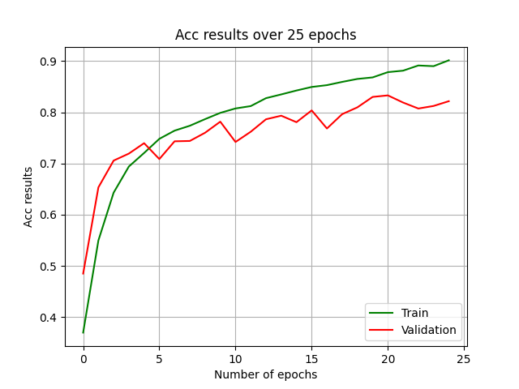
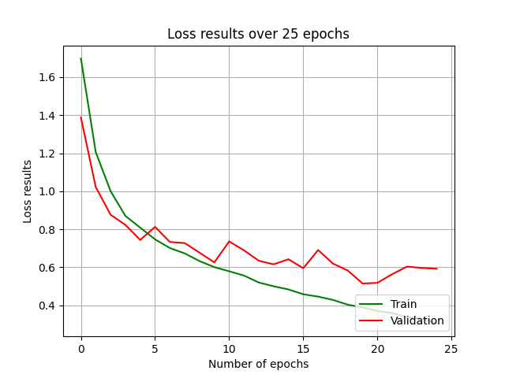
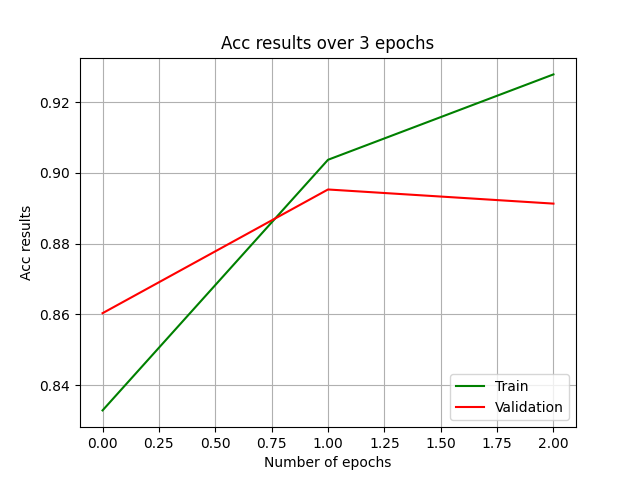
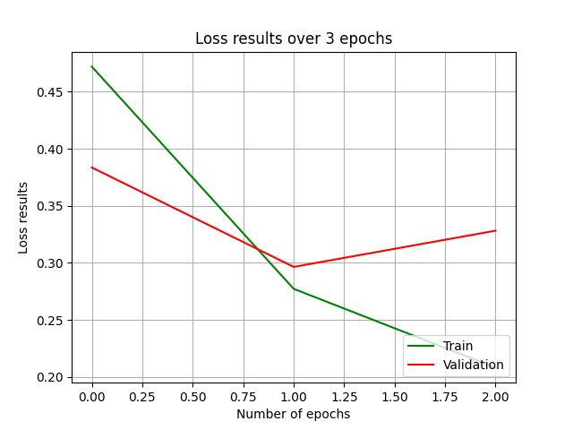

# Intel-Image-Classification
## Idea
The main objective of the project is classifying Intel Image dataset images into 6 classes, namely glacier, building, sea, forest, mountain and street. There are approximately 2.1 k images for each label. During the project CNN model was developed for classification task along with Transfer Learning Model VGG 16 for comparison reasons.
## Model 
Results that we will share here belong to the CNN model with 3 Convolutional Blocks (Convolutional Layer, Max Pooling Layer and Dropout Layer if it is needed) and 3 linear layers where one of them is output layer. Instead of using tensorflow's model.fit our own training session and early stopping callback were implemented. 

Additionally, dynamic model strategy that we used in CXR classification project was implemented here. By doing this, we are able to modify kernel dimensions, number of layers and other parameters easily, rather than add-delete mechanism that manual model creation demands. You can find all modifiable parameters from [utilities.py](utilities.py)
## Transfer Learning
Transfer Learning is a technique that we use pre-trained model weights to specific models (e.g., ResNET, VGG16 and etc.). In our approach we used frozen CNN layers, where CNN blocks are not trained. We use our last dense layer on top of the VGG 16 model.Additionally, we utilized ImageNet weights to classify results. Because of machine capacity, we can share only results of 3 epochs for now. However, we will do further refinements in future. Notice that, our model can use only VGG16 model for now, but further options will also be added.

## Early Stopping
As we mentioned above, we did not use model.fit property of tensorflow models and we built our training and evaluation loop, since this method increase availability of interference chances. Thus, we needed to write our own early stopping callback, since we do not use model.fit. All these details can be found in [train.py](train.py).

## Results
Following results were obtained by the model with the same configuration as given in [utilities.py](utilities.py). If you do not change anything and run it directly approximate results will be obtained on your side, as well. Possible change can occur because of randomness of the DL nature.

Accuracy and Loss performance of our CNN model can be seen from following figures.
 

  
 

Additionally, you can find results for transfer learning model from following figures, where the first one is for accuracy and the second one is for loss performances.
 

  
 

